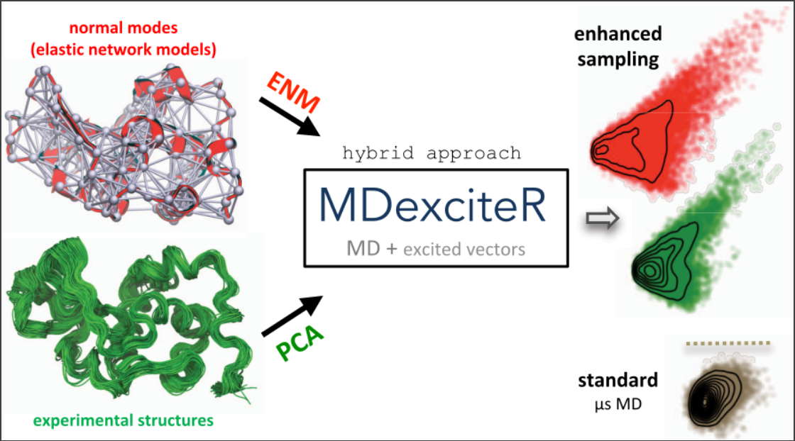

# MDexciteR

 This repository contains the required files to perform simulations using the Molecular Dynamics with Excited Normal Modes [(MDeNM) method](https://pubs.acs.org/doi/10.1021/acs.jctc.5b00003).
<br> <br>
The [MDexciteR tool](https://pubs.acs.org/doi/full/10.1021/acs.jctc.2c00599) is based on the combination of R internal libraries and functions from the [Bio3D package](http://thegrantlab.org/bio3d/) allowing users to generate and process files to run MDeNM with an external MD software (*e.g*. NAMD). The original method was developed as a CHARMM script, in which users to select a subset of all-atom normal modes to be excited during several short replica MD simulations. The new version adds improved functionalities, such as the possibility to work with normal modes calculated using simplified elastic network models. 
<br> <br>
<p align="center">

</p>
The excited dynamics approach (MDeNM) was designed to exhaustively explore the slow collective dynamics defined by the lowest frequency end of the vibrational spectrum and efficiently deal with the combinatorial problem of a multidimensional space. Instead of exploring only single NM vectors, multiple directions derived from random linear combinations of low-frequency NMs are kinetically excited in independent simulations. The large variety of energetically accessible conformations generated by our approach allows for the determination of the extents of sampling in a complex collective coordinate space without arbitrary assumptions. 
<br> <br>
<hr style="background:#000080; border:0; height:1px" />
</hr>

### **Requirements** 

This repository contains all files and instructions allowing the basic usage of MDexciteR in conjucntion with NAMD. All input/output manipulations, normal modes and linear algebra calculations are carried out with R using its internal functions and the routines included in the bio3d package. 

#### **install R** 
R can be easily installed through the package manager. Alternatively, it may also be downloaded from the [R-project web site](https://www.r-project.org/).

```{r, eval = FALSE}
apt-get install r-base-core 
```
#### **install Bio3D package**
To obtain the Bio3D package, start R and then type the following line:

```{r, eval = FALSE}
install.packages("bio3d")
```

Additional instructions for obtaining and installing the Bio3D package can be found in the [Installing Bio3D Vignette](http://thegrantlab.org/bio3d/tutorials).  

#### **install NAMD** 
Download the [NAMD executable](http://www.ks.uiuc.edu/Development/Download/download.cgi?PackageName=NAMD). 

To call NAMD from R/Bio3D, we advise users to edit the bash_profile file entering the place where the namd2 executable is found:
```{r, eval = FALSE}
export PATH="/path-to-namd-executable/:$PATH" 
```
The lysozyme structure (PDB code 2lzt) was selected as a test case. The MDexciteR code and the input files are found in this [zip file](mdexciter-test-nm.zip)

The [tutorial_file](tutorial_MDexciteR_2022.pdf) contains all necessary instructions to carry out simulations. 
<hr style="background:#000080; border:0; height:1px" />
The full description of the approach is available in the manuscript "MDexciteR: Enhanced-Sampling Molecular Dynamics by Excited Normal Modes or Principal Components Obtained from Experiments" (https://pubs.acs.org/doi/full/10.1021/acs.jctc.2c00599)
<br> <br>
<hr style="background:#000080; border:0; height:1px" />


  <br> <br>
  [](http://hits.dwyl.com/mcosta27/MDexciteR)
